# Laravel PHP Graph Lib


## 📜 History of PHP Graph Lib

The first version of PHP Graph Lib was created by [Elliott Brueggeman](https://github.com/elliottb) in late 2007 🙂 — almost 20 years ago! Good things really do stand the test of time.

You can thank [Elliott Brueggeman](https://github.com/elliottb) by giving stars to his repositories or following him. Remember, he created this library under the MIT License and made it freely available. Today, it remains one of the best PHP libraries for creating graphs and pie charts under the MIT License.

Since 2007 and the first version of this library PHP versions have changed and so the library evolved. Current version is compatible with PHP 8.2.

Current repo is forked from [repository](https://github.com/Troopster19/PhpGraph) of [Troopster19](https://github.com/Troopster19/PhpGraph) and at the moment of forking code was under MIT licence.


## ❓ What does this package do?

This package allows you to create graph and pie chart images. You have several options for handling images, including:


- Displaying image from php memory
- Save image to storage in Laravel and later handle that image
- Save image to public directory in Laravel. This way you have public access to this image. This package provides URL for public images.

---

## 🚀 Installation

### Requirements

- PHP >= 8.0
- Laravel >= 9
- PHP Extensions:
  - [GD library](https://www.php.net/manual/en/book.image.php) (`ext-gd`)

### Composer Installation

```bash
composer require noki/laravel-php-graph
```

## ⚙️ PHP GD Extension Setup

### Linux (Debian/Ubuntu)

```bash
sudo apt-get update
sudo apt-get install php-gd
````

> Example for PHP 8.3 — be sure to use the correct package names:

First, check your PHP version:

```bash
php -v
```

Then install GD for your version:

```bash
sudo apt-get install php8.3-gd
```

To verify if GD is installed:

```bash
php -m | grep gd
```

---

### macOS (with Homebrew)

```bash
brew install php
# OR, if PHP is already installed:
brew reinstall php
```

> The GD extension (`gd`) is bundled with PHP on macOS. No extra installation is usually required.

To confirm GD is enabled:

```bash
php -m | grep gd
```

---

### Windows

1. Open your `php.ini` file.
2. Ensure the following line is **uncommented** (remove the `;` at the beginning):

```ini
extension=gd
```

3. Restart your web server (Apache, Nginx) or PHP-FPM.

### Verify installation
Run the following command to check if GD is enabled:

```bash
php -m | findstr gd
```

---


## 📦 Usage

### Namespace

```php
use Noki\PhpGraph\Graph;
```

---

### 1. Create a private graph (not publicly accessible)

```php
        $data = array(
            12124,
            5535,
            43373,
            22223,
            90432,
            23332,
            15544,
            24523,
            32778,
            38878,
            28787,
            33243,
            34832,
            32302
        );

        $graph = new Graph(500, 350);

        $graph->setTitle('Widgets Produced');
        $graph->setGradient('red', 'maroon');
        $graph->addData($data);
        $file_path = $graph->createGraph('my_file_name' ,'F');
```

With line

```php
$file_path = $graph->createGraph('my_file_name' ,'F');
```

it is set file name without extension or directory root. Parameter 'F' is used for output to file. This file will be saved in **storage/app/private/php-graph-data** directory inside Laravel.

File will be saved at that route and in variable **$file_path** will be set route to graph image.

> **Important notes:**
> 1. Only ASCII codes are allowed in texts in PHP Graph Lib.
> 2. Since the output image format is always **PNG**, you **do not need to set a file extension** — any extension you provide will be ignored and `.png` will be automatically added.
>
> Also, if you include a directory path in the file name, it will be removed, because **all images are saved in the `storage/app/private/php-graph-data` directory**.

---

### 2. Create a public graph (publicly accessible)

Use same code as above for graph drawing just change last line

```php
$file_url = $graph->createGraph('my_file_name' ,'U');
```

This way image will be saved to **public/images/php-graph-data/** directory. This image will be publicly accessible. In variable **$file_url** will be returned URL to this image.

> **Important note:**
> 1. Only ASCII codes are allowed in texts in PHP Graph Lib.
> 2. Since the output image format is always **PNG**, you **do not need to set a file extension** — any extension you provide will be ignored and `.png` will be automatically added.
>
> Also, if you include a directory path in the file name, it will be removed, because **all images are saved in the `public/images/php-graph-data` directory**.

---

---

### 3. Save image in PHP memory and display it without save to server

This is example of creating image from Controller.

1. Create route in `routes/web.php`

```php
Route::get('/testing', [TestController::class, 'testing']);
```

2. Create controller in `app/Http/TestController.php`
```php
<?php

namespace App\Http\Controllers;

use Noki\PhpGraph\Graph;

class TestController extends Controller
{
    public function testing()
    {
        $data = array(
            12124,
            5535,
            43373,
            22223,
            90432,
            23332,
            15544,
            24523,
            32778,
            38878,
            28787,
            33243,
            34832,
            32302
        );

        $graph = new Graph(500, 350);

        $graph->setTitle('Widgets Produced');
        $graph->setGradient('red', 'maroon');
        $graph->addData($data);
        $image_content = $graph->createGraph();

        return response($image_content)->header('Content-Type', 'image/png');

    }

}
```

---

## Summary of options
- Save to file for internal use:

```php
$graph->createGraph('my_file_name' ,'F');
```
- Save to file and file can be publicly accessed:

```php
$graph->createGraph('my_file_name' ,'U');
```
- Save to memory
```php
$graph->createGraph();
```

---

# 🧪 Examples

### Example 1 - Graph

```php
<?php

    use Noki\PhpGraph\Graph;

	$data = array(
		12124,
		5535,
		43373,
		22223,
		90432,
		23332,
		15544,
		24523,
		32778,
		38878,
		28787,
		33243,
		34832,
		32302
	);

	$graph = new Graph(500, 350);

	$graph->setTitle('Widgets Produced');
	$graph->setGradient('red', 'maroon');

	$graph->addData($data);

    $file_path = $graph->createGraph('example1', 'F');
```

### Creates graph:
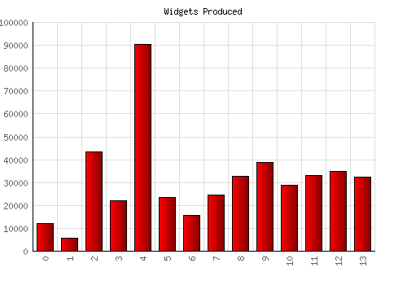


### Example 2 - Graph

```php
<?php

    use Noki\PhpGraph\Graph;

	$data = array(
		"Jan" => -1324,
		"Feb" => -1200,
		"Mar" => -100,
		"Apr" => -1925,
		"May" => -1444,
		"Jun" => -957,
		"Jul" => -364,
		"Aug" => -221,
		"Sep" => -1300,
		"Oct" => -848,
		"Nov" => -719,
		"Dec" => -114
	);

	$graph = new Graph(500, 450);

	$graph->setBarColor('255, 255, 204');
	$graph->setTitle('Money Made at XYZ Corp');
	$graph->setTextColor('gray');

	$graph->addData($data);

    $url = $graph->createGraph('example2', 'U');
```

### Creates graph:
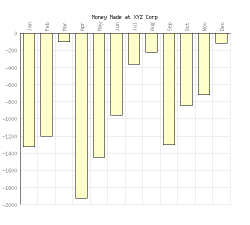

### Example 3 - Graph

```php
<?php

    use Noki\PhpGraph\Graph;

	$data = array(
		"Roger" => 145,
		"Ralph" => 102,
		"Rhonda" => 123,
		"Ronaldo" => 137,
		"Rosario" => 149,
		"Robin" => 99,
		"Robert" => 88,
		"Rustof" => 111
	);

	$graph = new Graph(350, 280);

	$graph->setBackgroundColor("black");
	$graph->setBarColor('255, 255, 204');
	$graph->setTitle('IQ Scores');
	$graph->setTitleColor('yellow');
	$graph->setupYAxis(12, 'yellow');
	$graph->setupXAxis(20, 'yellow');
	$graph->setGrid(false);
	$graph->setGradient('silver', 'gray');
	$graph->setBarOutlineColor('white');
	$graph->setTextColor('white');
	$graph->setDataPoints(true);
	$graph->setDataPointColor('yellow');
	$graph->setLine(true);
	$graph->setLineColor('yellow');

	$graph->addData($data);

    $graph->createGraph();
```

### Creates graph:
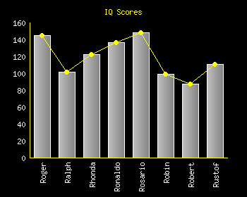


### Example 4 - Graph

```php
<?php

    use Noki\PhpGraph\Graph;

	$data = array(
		"Alpha" => 1145,
		"Beta" => 1202,
		"Cappa" => 1523,
		"Delta" => 1437,
		"Echo" => 949,
		"Falcon" => 999,
		"Gamma" => 1188
	);

	$data2 = array(
		"Alpha" => 898,
		"Beta" => 1498,
		"Cappa" => 1343,
		"Delta" => 1345,
		"Echo" => 1045,
		"Falcon" => 1343,
		"Gamma" => 987
	);

	$graph = new Graph(520, 280);

	$graph->setBarColor('blue', 'green');
	$graph->setTitle('Company Production');
	$graph->setupYAxis(12, 'blue');
	$graph->setupXAxis(20);
	$graph->setGrid(false);
	$graph->setLegend(true);
	$graph->setTitleLocation('left');
	$graph->setTitleColor('blue');
	$graph->setLegendOutlineColor('white');
    $graph->setLegendColor('orange');
	$graph->setLegendTitle('Week-37', 'Week-38');
	$graph->setXValuesHorizontal(true);

	$graph->addData($data, $data2);

    $file_path = $graph->createGraph('example4', 'F');
```

### Creates graph:
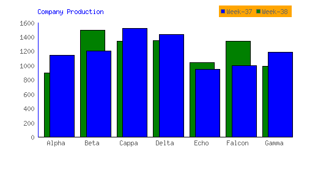


### Example 5 - Graph

```php
<?php

    use Noki\PhpGraph\Graph;

	$graph = new Graph(500, 280);

	$data = array(23, 45, 20, 44, 41, 18, 49, 19, 42);
	$data2 = array(15, 23, 23, 11, 54, 21, 56, 34, 23);
	$data3 = array(43, 23, 34, 23, 53, 32, 43, 41);

	$graph->setTitle('CPU Cycles x1000');
	$graph->setTitleLocation('left');
	$graph->setLegend(true);
	$graph->setLegendTitle('Module-1', 'Module-2', 'Module-3');
	$graph->setGradient('green', 'olive');

	$graph->addData($data, $data2, $data3);

    $url = $graph->createGraph('example5', 'U');
```

### Creates graph:
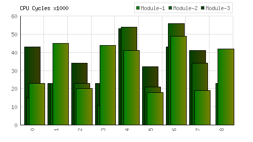


### Example 6 - Graph

```php
<?php

    use Noki\PhpGraph\Graph;

	$data = array(
		"Jan" => -10.1,
		"Feb" => -3.6,
		"Mar" => 11.0,
		"Apr" => 30.7,
		"May" => 48.6,
		"Jun" => 59.8,
		"Jul" => 62.5,
		"Aug" => 56.8,
		"Sep" => 45.5,
		"Oct" => 25.1,
		"Nov" => 2.7,
		"Dec" => -6.5
	);

	$graph = new Graph(450, 300);

	$graph->setBarColor('navy');
	$graph->setupXAxis(20, 'blue');
	$graph->setTitle('Average Temperature by Month, in Fairbanks Alaska');
	$graph->setTitleColor('blue');
	$graph->setGridColor('153, 204, 255');
	$graph->setDataValues(true);
	$graph->setDataValueColor('navy');
	$graph->setDataFormat('degrees');
	$graph->setGoalLine('32', 'fuscia', 'dashed');

	$graph->addData($data);

	$graph->createGraph();
```

### Creates graph:
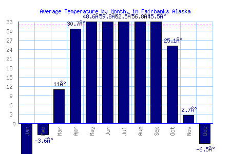


### Example 7 - Graph

```php
<?php

    use Noki\PhpGraph\Graph;

	$data = array(
		"1" => .0032,
		"2" => .0028,
		"3" => .0021,
		"4" => .0033,
		"5" => .0034,
		"6" => .0031,
		"7" => .0036,
		"8" => .0027,
		"9" => .0024,
		"10" => .0021,
		"11" => .0026,
		"12" => .0024,
		"13" => .0036,
		"14" => .0028,
		"15" => .0025
	);

	$graph = new Graph(650, 200);

	$graph->addData($data);
	$graph->setTitle('PPM Per Container');
	$graph->setBars(false);
	$graph->setLine(true);
	$graph->setDataPoints(true);
	$graph->setDataPointColor('maroon');
	$graph->setDataValues(true);
	$graph->setDataValueColor('maroon');
	$graph->setGoalLine(.0025, 'red');

	$file_path = $graph->createGraph('example7', 'F');
```

### Creates graph:
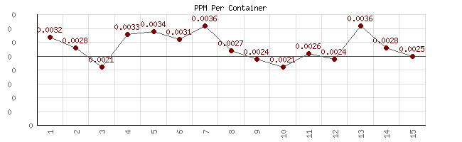


### Example 8 - Pie Graph

```php
<?php

    use Noki\PhpGraph\PieGraph;

	$data = array(
		"CBS" => 6.3,
		"NBC" => 4.5,
		"FOX" => 2.8,
		"ABC" => 2.7,
		"CW" => 1.4
	);

	$graph = new PieGraph(400, 200);

	$graph->setTitle('8/29/07 Top 5 TV Networks Market Share');
	$graph->setLabelTextColor('50, 50, 50');
	$graph->setLegendTextColor('50, 50, 50');

	$graph->addData($data);

	$graph->createGraph('example8');
```

### Creates pie graph:
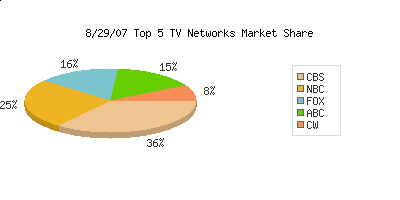


### Example 9 - Graph

```php
<?php
    use Noki\PhpGraph\Graph;

	$data = array(
		'alpha' => 23,
		'beta' => 45,
		'cappa' => 20,
		'delta' => 32,
		'echo' => 14
	);

	$data2 = array(
		'alpha' => 15,
		'beta' => 23,
		'cappa' => 23,
		'delta' => 12,
		'echo' => 17
	);

	$data3 = array(
		'alpha' => 43,
		'beta' => 23,
		'cappa' => 34,
		'delta' => 16,
		'echo' => 20
	);

	$data4 = array(
		'alpha' => 23,
		'beta' => 34,
		'cappa' => 23,
		'delta' => 9,
		'echo' => 8
	);

	$graph = new Graph(495, 280);

	$graph->setupYAxis("15");
	$graph->setGradient('teal', '#0000FF');
	$graph->setXValuesHorizontal(true);
	$graph->setXAxisTextColor ('navy');
	$graph->setLegend(true);
	$graph->setLegendTitle('M1', 'M2', 'M3', 'M4');

	$graph->addData($data, $data2, $data3, $data4);

	$file_path = $graph->createGraph('example9', 'F');
```

### Creates graph:
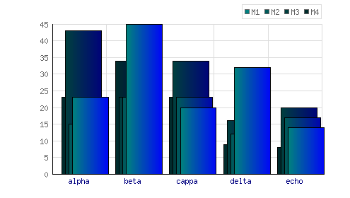


### Example 10 - Stacked Graph

```php
<?php

    use Noki\PhpGraph\StackedGraph;

	$popularity = array('Windows 7' => 80, 'Mac OS 10' => 35, 'Fedora' => 9);
	$cost = array('Windows 7' => 10, 'Mac OS 10' => 30, 'Fedora' => 90);
	$speed = array('Windows 7' => 50, 'Mac OS 10' => 50, 'Fedora' => 80);

	$graph = new StackedGraph(500, 300);

	$graph->setTitle('Operating System Scores');
	$graph->setTitleLocation('left');
	$graph->setXValuesHorizontal(true);
	$graph->setTextColor('blue');
	$graph->setBarColor('#0066CC', '#669999', '#66CCCC');
	$graph->setLegend(true);
	$graph->setLegendTitle('Popularity', 'Cost', 'Speed');

	$graph->addData($popularity, $cost, $speed);

	$file_path = $graph->createGraph('example10', 'F');
```

### Creates graph:
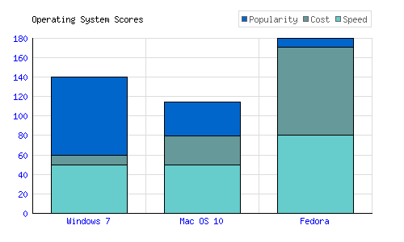


### Example 11 - Graph

```php
<?php

    use Noki\PhpGraph\Graph;

	$set1 = array (
		1917 => 4011, 1918 => 4886, 1919 => 5411,
		1920 => 5831, 1921 => 5865, 1922 => 5704, 1923 => 5337, 1924 => 5144,
		1925 => 5018, 1926 => 4971, 1927 => 4630, 1928 => 4411, 1929 => 4287,
		1930 => 4116, 1931 => 3940, 1932 => 3764, 1933 => 3592, 1934 => 3447,
		1935 => 3280, 1936 => 3215, 1937 => 3366, 1938 => 3569, 1939 => 3598,
		1940 => 4436, 1941 => 5939, 1942 => 7397, 1943 => 8855, 1944 => 9835,
		1945 => 9998, 1946 => 10631, 1947 => 11340, 1948 => 11549, 1949 => 11642,
	);

	$set2 = array (
		1910 => 2059, 1911 => 2135, 1912 => 2209, 1913 => 2332, 1914 => 2437,
		1915 => 2786, 1916 => 3747, 1917 => 5011, 1918 => 5886, 1919 => 6411,
		1920 => 6831, 1921 => 6865, 1922 => 6704, 1923 => 6337, 1924 => 6144,
		1925 => 6018, 1926 => 5971, 1927 => 5630, 1928 => 5411, 1929 => 5287,
		1930 => 5116, 1931 => 4940, 1932 => 4764, 1933 => 4592, 1934 => 4447,
		1935 => 4280, 1936 => 4215, 1937 => 4366, 1938 => 4569, 1939 => 4598,
		1940 => 5436, 1941 => 5939, 1942 => 8397, 1943 => 9855, 1944 => 10835,
	);

	$graph = new Graph(600, 400);

	$graph->setTitleLocation('left');
	$graph->setTitle("Two sets with different start points");
	$graph->setBars(false);
	$graph->setLine(true);
	$graph->setDataPoints(false);
	$graph->setLineColor('blue', 'red');
	$graph->setDataValues(false);
	$graph->setXValuesInterval(5);
	$graph->setDataValueColor('blue', 'red');
	$graph->setLegend(true);
	$graph->setLegendTitle("set1", "set2");

	$graph->addData($set1, $set2);

	$file_path = $graph->createGraph('example11', 'F');
```

### Creates graph:
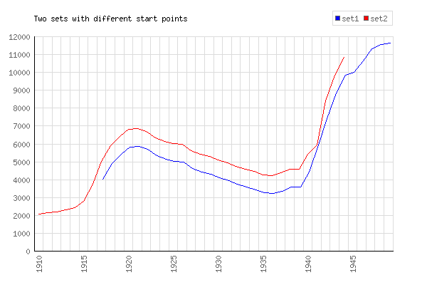


---

## 🛠 Error Handling

- If the GD library cannot be loaded, a `PhpGraphException` will be thrown.

---

## 🧩 Integration with Laravel


You can easily use this package in your **controllers**, **services**, or **jobs** by importing the relevant namespaces:

```php
use Noki\PhpGraph\Graph;
use Noki\PhpGraph\PieGraph;
use Noki\PhpGraph\StackedGraph;
```

Once imported, you can create graphs and pie charts directly in your application.

---

## 📄 License

MIT License.
See [LICENSE.md](LICENSE.md) for details.

---

## 🙌 Contributing

Feel free to fork and submit a PR!
Bug reports and feature requests are always welcome.

---

## 🔗 Author Of Php Graph Lib

- [Elliott Brueggeman](https://github.com/elliottb)

## 🔗 Contributors

- [Novak Urošević](https://github.com/novakurosevic)
- [James Wakelim](https://github.com/jwakelim)
- [Petr Hurtak](https://github.com/Hurtak)
- [Pål Saugstad](https://github.com/pal-saugstad)
- [Ahmet Gencoglu](https://github.com/LupenWonse)
- [David Gil de Gómez IV](https://github.com/studiosi)
- [Manuel R](https://github.com/eSkiSo)
- [Troopster19](https://github.com/Troopster19)

---

## 📝 Changelog

Please see [CHANGELOG.md](CHANGELOG.md) for recent updates.

